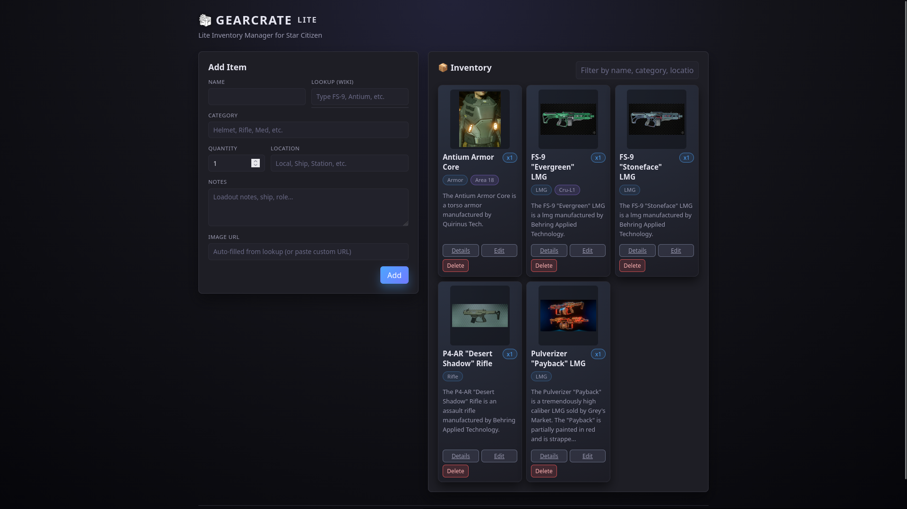

# 📦 GearCrate Lite  
Lite Inventory Manager for Star Citizen  
*A simplified remix of GearCrate:* https://github.com/KruemelGames/GearCrate

GearCrate Lite is a lightweight Flask web application for quickly tracking weapons, armor, consumables, and loadout gear.  
It uses a local SQLite database, runs offline, and includes automatic wiki lookup + thumbnail support.

---

## 🖥️ Supported Operating Systems

GearCrate Lite runs on:

- **Windows 10 / 11**
- **Linux (Ubuntu, Debian, Mint, Arch, Fedora, etc.)**
- **WSL2**
- **Raspberry Pi (ARM)**

Instructions for both platforms are provided below.

---

# 🚀 Features

- Clean, dark UI built for quick inventory entry  
- Automatic merging of identical items  
- Wiki lookup with thumbnails & descriptions  
- Local SQLite storage (no cloud required)  
- Single-file Flask backend  
- Lightning-fast offline operation  

---

## Preview



# 📂 Project Structure

```
GearCrateLite/
│
├── app.py
├── inventory.db            # auto-created
├── requirements.txt
├── README.md
│
├── templates/              # HTML files
│   ├── index.html
│   ├── edit_item.html
│   └── view_item.html
│
└── static/                 # CSS, logos, assets
    ├── css/
    │   └── styles.css
    └── img/logos/
        ├── GearCrate_Logo.png
```

---

# 🛠️ Installation & Setup

Below are complete setup instructions for **Windows** and **Linux**.

---

# 🔹 Windows Installation

### 1. Install Python
Download Python from:  
https://www.python.org/downloads/

✔ Make sure **"Add Python to PATH"** is checked during install.

---

### 2. Open Command Prompt or PowerShell

Navigate to the GearCrateLite folder:

```powershell
cd path\to\GearCrateLite
```

---

### 3. Create a virtual environment

```powershell
python -m venv venv
```

Activate it:

```powershell
venv\Scripts\activate
```

---

### 4. Install dependencies

```powershell
pip install -r requirements.txt
```

---

### 5. Run the app

```powershell
python app.py
```

Open your browser and visit:

```
http://127.0.0.1:5000
```

---

# 🔹 Linux Installation

### 1. Install Python & tools

Ubuntu/Debian example:

```bash
sudo apt update
sudo apt install -y python3 python3-pip python3-venv
```

---

### 2. Navigate to the project

```bash
cd GearCrateLite
```

---

### 3. Create a virtual environment

```bash
python3 -m venv venv
source venv/bin/activate
```

---

### 4. Install Python dependencies

```bash
pip install -r requirements.txt
```

---

### 5. Run the app

```bash
python3 app.py
```

Open:

```
http://127.0.0.1:5000
```

---

# 🌐 Optional: Access on your LAN

If you want other devices to access GearCrate Lite:

Edit the last line of `app.py`:

```python
app.run(debug=True, host="0.0.0.0")
```

Then start the app normally.

Other devices can now open:

```
http://YOUR_LOCAL_IP:5000
```

Example:

```
http://192.168.1.50:5000
```

---

# 🗄️ Database

All data is stored in:

```
inventory.db
```

### Reset everything:

```
Delete inventory.db → restart the app
```

The file will be recreated automatically.

---

# 🔧 Development Notes

### ⚠ Do NOT upload your virtual environment (`venv/`) to GitHub.

Your `.gitignore` should include:

```
venv/
.venv/
__pycache__/
*.pyc
inventory.db
```

---

# 🧑‍🚀 Enjoy GearCrate Lite!
